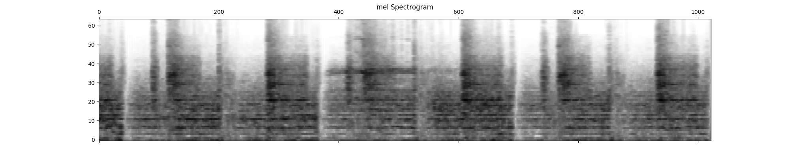
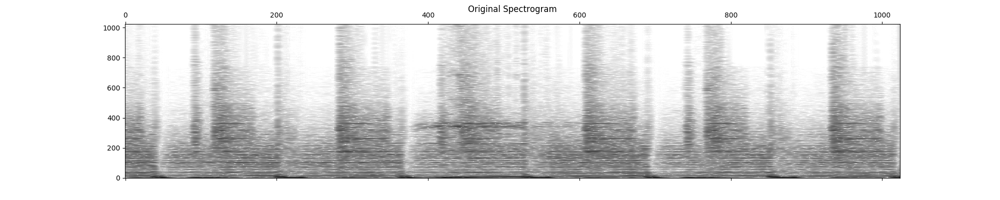

# beat detection with convolutional neural networks on audio spectrograms

Attempting to use convolutional nets to accurately (not yet) classify music by bpm.

* `data_processor.py` contains code for transforming mp3/wav audio files into spectrograms/mel spectrograms with associated metadata and methods for saving to file/visualising

Example MEL spectrogram used as input to CNN:

Example spectrogram used as input to CNN:

* `dataset_creation.py` creates pickled datasets.

* `data_acquisition.py` is a script to download tracks/metadata from plex server (not usable out of the box for others)

Current organic dataset is ~2500 house and techno tracks, which when sampled 15 times at random 10 second intervals, with synthetic noisy and sped-up/slowed down data added results in around 187,000 training examples

## Evaluation

Training on a single GTX970 takes a long time. Current best architechture consists of a several convolutional/max pooling layers followed by a couple of dense layers with dropout. 

* Current precision/recall is not satisfactory, performs worse than most deterministic beat detection algorithms.

## TODO:

Train for a > 1 day.
Ensure GPU memory is properly cleared (CUDA memory errors common)
Clear out more high freqs
Convolutional filter size should be such to only allow horizontal movement to capture temporal nature
